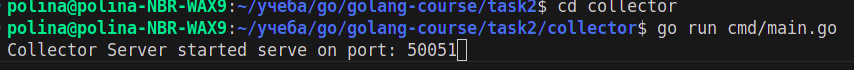
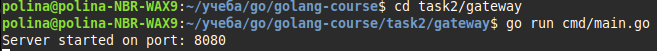
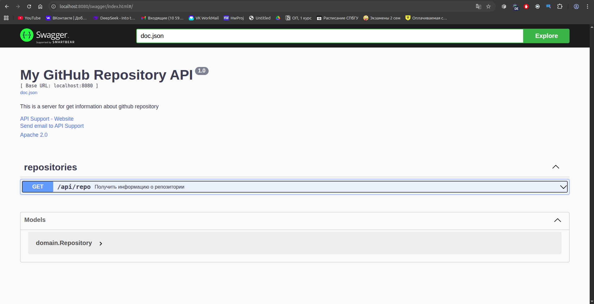
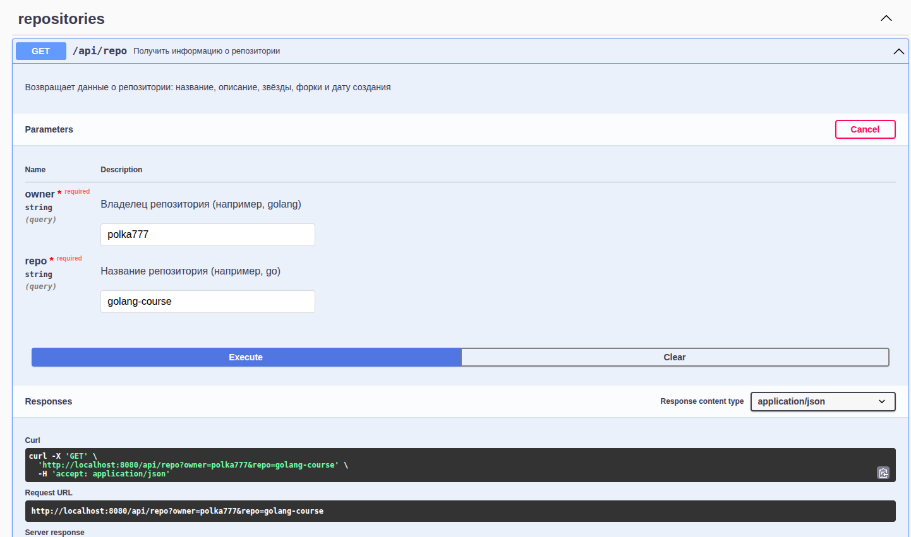
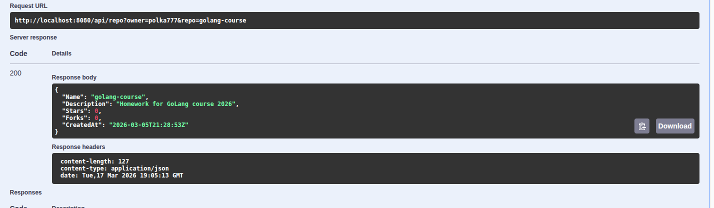
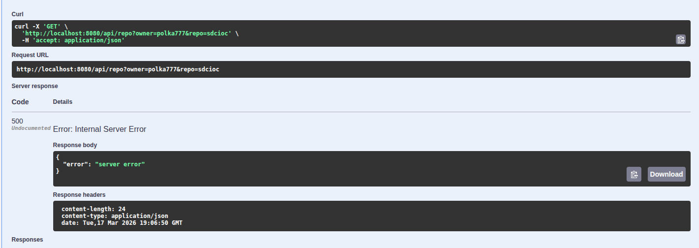

# Build and start
```bash
cd collector
go run cmd/main.go
```


```bash
cd gateway
go run cmd/main.go
```


http://localhost:8080/swagger/index.html#/


# Создаем запрос 



Удачный ответ



Неудачный ответ

